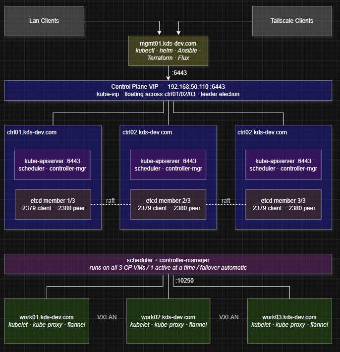
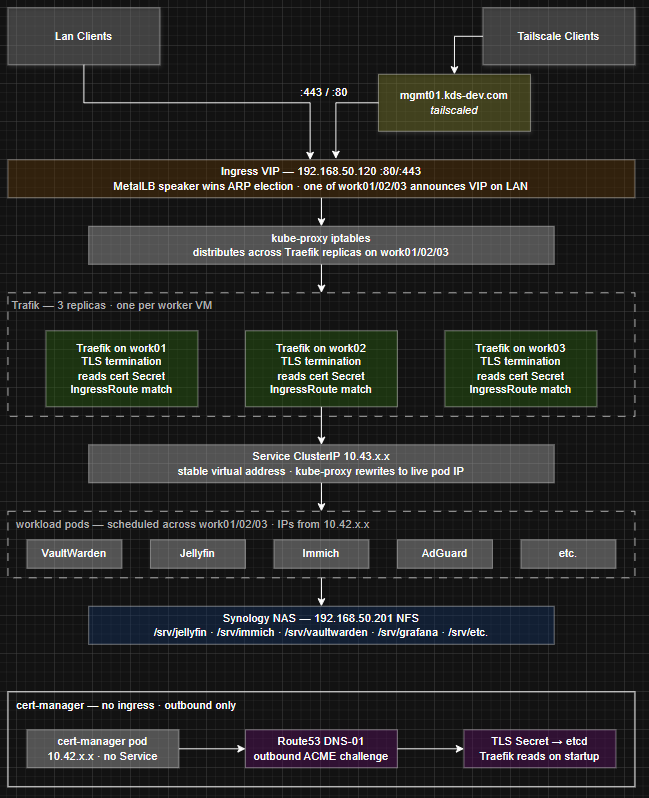
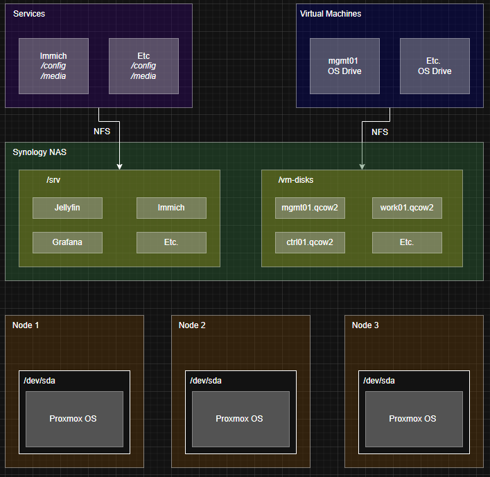

# homelab v2

**Status: Active Development**
---
## Infrastructure and Network
<!-- Link to Hardware Section -->
This lab is built on 3 ThinkCentres for the compute layer and a Synology NAS for storage. It is built on top of a Proxmox cluster to allow for HA of the management server, as well as enabling VM snapshots, backups, and management.

[Hardware Specs](#hardware)

[Network Charts](#networks)

## Control Plane
The Control Plane consists of 3 VMs operating as k3s control plane nodes. All management tooling (kubectl, helm, Terraform, Ansible, Flux) runs in the developer's WSL environment. A dedicated Tailscale VM (`ts1`) provides persistent remote access to the LAN and survives cluster failure, preserving the recovery path. It is designed to be fully HA, allowing any node to go down with no interruption to normal operations.

---
## Services
Services are reverse proxied via Traefik running on each node, with a virtual IP address in front via MetalLB to handle HA failover. Traffic is routed using service names to cluster IP addresses, which are rewritten by k3s to service addresses to route to the correct pod. All application data is stored on the NAS via NFS mount points in the containers within the pods.

---
## Storage
- Proxmox is installed on the physical nodes local storage and is the only thing that will be placed there.
- VM's will be provisioned with 1 50GB disk that will be used to install the OS, required packages, and binaries. It will have a mount to the NAS for application data.
- NAS has NFS exports for `/vm-disks`, where all VMDKs will be stored, and `/srv`, where subdirectories will be created for each application (e.g. `/srv/jellyfin/`).

---

### Known Limitations
1. Flat /24 network — current router does not support VLANs, so control 
   plane, storage, and workload traffic share the same L2 segment
2. NAS is a single point of failure for storage — mitigated by active/standby 
   bonded NICs and RAID 5, but a NAS failure takes down both VM disks and 
   application data
3. Tailscale free tier limits devices — ts1 VM holds one of the three device
   slots; Proxmox HA ensures it restarts on a surviving node if its host fails

### Design Decisions

1. **Dedicated Tailscale VM (ts1, .131)**
   A dedicated VM runs the Tailscale daemon and advertises the LAN subnet 
   (192.168.50.0/24) to the tailnet. This allows all remote devices to reach 
   LAN hosts without installing Tailscale on each one. It runs as a VM under 
   Proxmox HA rather than as a Kubernetes pod because it must survive cluster 
   failure — if k3s is broken, ts1 is the recovery path. All management 
   tooling (kubectl, helm, Terraform, Ansible, Flux) runs in the developer's 
   WSL environment instead.

2. **k3s on Proxmox VMs rather than bare metal**
   Running k3s inside Proxmox VMs rather than directly on bare metal provides 
   clean separation between the control plane and worker roles without 
   requiring additional physical hardware. It also provides VM-level snapshots 
   before risky changes, a recovery path when k3s itself is broken, and 
   consistent OS images via cloud-init templating. Three dedicated control 
   plane VMs maintain etcd quorum independently of the three worker VMs.

3. **IP block segmentation as a VLAN substitute**
   Without VLAN support on the current router, IP ranges within the /24 are 
   segmented by infrastructure role. Each block reserves the .x0 address for 
   virtual IPs, load balancers, or floating addresses, with .x1–.x3 
   corresponding to which physical node a workload runs on. This makes the 
   network self-documenting and provides a clear path to proper VLAN 
   segmentation if router hardware is upgraded.

4. **Control plane and worker VMs pinned to their respective hosts**
   Pinning VMs to specific Proxmox nodes ensures one control plane and one 
   worker are always present on each physical node. Without pinning, the 
   Proxmox scheduler could place two control plane VMs on the same node — 
   losing that node would drop two etcd members simultaneously, breaking 
   quorum. Pinning guarantees the failure domain stays at one node regardless 
   of cluster events.

5. **k3s internal networks isolated from LAN**
   k3s maintains two internal overlay networks that are intentionally 
   invisible to the physical LAN. The pod network (10.42.0.0/16) is a flannel 
   VXLAN overlay tunneled between worker VMs — pods get ephemeral IPs from 
   this range that the LAN switch never sees. The service network 
   (10.43.0.0/16) is not a real network at all — these IPs exist only as 
   iptables rules maintained by kube-proxy on each worker and are never 
   transmitted on the wire. All external access into the cluster is funneled 
   exclusively through MetalLB service IPs in the .120–.129 range, keeping 
   the boundary between cluster-internal and LAN-routable traffic explicit 
   and controlled.
6. **Pod / Cluster and Service CIDR Ranges**
Pod and Service CIDRs use k3s defaults (10.42.0.0/16 and 10.43.0.0/16) 
as neither conflicts with existing LAN or Tailscale address space.

## Networks
### IP Ranges — 192.168.50.0/24

| Range     | Role                                                        |
|-----------|-------------------------------------------------------------|
| .1        | Default gateway                                             |
| .2–.99    | DHCP clients                                                |
| .100–.109 | Physical nodes (.101, .102, .103)                           |
| .110–.119 | Control plane VMs (.110 VIP, .111–.113 VMs)                 |
| .120–.129 | Worker / MetalLB pool (.120 Traefik, .121–.123 worker VMs)  |
| .130–.139 | Infrastructure VMs (.131 ts1 — Tailscale subnet router)     |
| .200–.209 | Storage (.201 Synology NAS)                                 |

### k3s Internal Networks

| Network        | Range          | Purpose                                                        |
|----------------|----------------|----------------------------------------------------------------|
| Pod CIDR       | 10.42.0.0/16   | Flannel VXLAN overlay — ephemeral pod IPs, not routable on LAN |
| Service CIDR   | 10.43.0.0/16   | kube-proxy iptables rules — virtual only, never on wire        |
| MetalLB pool   | .120–.129      | Only cluster IPs visible on LAN — single entry point           |

---

### Hardware

| Type    | Role      | Model                  | Notes                  |
|---------|-----------|------------------------|------------------------|
| Compute | k3s node  | ThinkCentre M710q Tiny | Intel i5 / 16GB DDR4   |
| Compute | k3s node  | ThinkCentre M710q Tiny | Intel i5 / 16GB DDR4   |
| Compute | k3s node  | ThinkCentre M710q Tiny | Intel i5 / 16GB DDR4   |
| Storage | NAS       | Synology DS418         | 4x 4TB Disks, RAID 5   |
| Network | L2 Switch | Netgear GS308          | 8 Port Unmanaged Switch|
| Network | Router    | ASUS RT-AX82U          | Home Router            |
| Network | Modem     | ISP Provided           | -                      |
