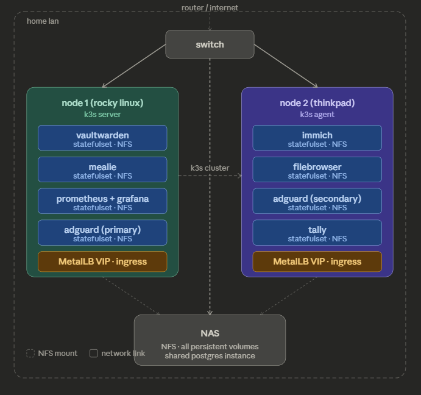

# homelab v2

**Status: Active Development**

A 3-node bare-metal Kubernetes cluster built for high availability, zero-touch automated provisioning, and production-grade operations practices. Running Rocky Linux 9 with SELinux enforcing. Any node can be unplugged at any time — the cluster continues operating and scheduling workloads without any manual intervention.

> v1 ran on a single host with Docker Compose. v2 rebuilds the entire stack on purpose-purchased hardware specifically to implement real HA, learn k3s in depth, and develop skills directly applicable to production Kubernetes environments.

<p>
  
  
  
  
  
  
  
  
  
</p>

---


*3-node k3s cluster — all nodes run the full control plane with embedded etcd. Any node can be lost without interrupting cluster operations or running workloads.*

---

> This document describes the target architecture. The progress tracker at the bottom reflects current implementation state.

---

## Table of Contents

- [Architecture Overview](#architecture-overview)
- [Provisioning](#provisioning)
- [Configuration Management](#configuration-management)
- [K3s Cluster](#k3s-cluster)
- [Network Layout](#network-layout)
- [Services](#services)
- [Backup and DR](#backup-and-dr)
- [Monitoring, Observability, and Alerting](#monitoring-observability-and-alerting)
- [Design Decisions](#design-decisions)
- [Progress Tracker](#progress-tracker)

---

## Architecture Overview

Three Lenovo ThinkCentre M710q Tiny nodes running Rocky Linux 9 with SELinux enforcing. All nodes participate in the k3s cluster as server nodes with embedded etcd, providing a true HA control plane — loss of any single node does not interrupt cluster operations or running workloads.

All persistent storage is NFS-backed against a NAS. No application data lives on node-local storage, which allows k3s to reschedule any pod to any surviving node without manual intervention or data migration.

MetalLB provides VIP assignment in Layer 2 mode. Services get stable LAN IPs that float with their pods regardless of which node they are scheduled on.

> **Diagram placeholder** — physical architecture diagram to be added once cluster is provisioned and validated.

### Design goals

- Unplug any node at any time. Nothing goes down.
- No manual steps exist outside of version-controlled tooling.
- Monitoring catches real outages.

### Hardware

| Type    | Role      | Model                  | Notes                  |
|---------|-----------|------------------------|------------------------|
| Compute | k3s node  | ThinkCentre M710q Tiny | Intel i5 / 16GB DDR4   |
| Compute | k3s node  | ThinkCentre M710q Tiny | Intel i5 / 16GB DDR4   |
| Compute | k3s node  | ThinkCentre M710q Tiny | Intel i5 / 16GB DDR4   |
| Storage | NAS       | Synology DS418         | 4x 4TB Disks RAID 5    |
| Network | L2 Switch | Netgear GS308          | 8 Port Unmanaged Switch|
| Network | Router    | ASUS RT-AX82U          | Home Router            |
| Network | Modem     | ISP Provided           | -                      |

> OS disks are used for the operating system, k3s binaries, and container image cache only. All application data lives on the NAS over NFS.

---

## Provisioning

### Goal

Zero-touch bare metal provisioning. Boot a node from USB, walk away. The node installs Rocky Linux 9, configures itself to a known baseline, and notifies the provisioning server to trigger Ansible automatically. No manual steps after inserting the USB.

### High Level Overview
> For more information on this process refer to [provisioning/readme.md](provisioning/readme.md)

1. A Python HTTP server running on the operator's machine serves the kickstart file and triggers the initial Ansible run

    - Endpoint for serving kickstart files populates the template with the IP and hostname from the URL path:
      ```
      http://provisioning-host:8080/ks/192.168.50.101/k3s-node1
      ```

    - Endpoint that triggers the initial Ansible playbook run:
      ```
      http://provisioning-host:8080/ansible/192.168.50.101
      ```

2. The kickstart file handles OS installation only

3. On install completion the node calls back to the provisioning server to trigger the Ansible playbook

4. The provisioning server spawns an Ansible run against that node automatically. By the time the node finishes rebooting, Ansible has already converged it.

---

## Configuration Management

### Goal

Every node is identical. No configuration exists outside of Ansible. Running the playbook against a freshly provisioned node or a node that has been running for a year produces the same result. Config drift is structurally impossible when Ansible is the only path to making changes.

### Approach

A single idempotent playbook runs at provisioning time (triggered automatically) and any time configuration changes need to be applied. There is no separate bootstrap playbook. The same playbook runs in both contexts because idempotency means there is no meaningful difference between first run and subsequent runs.

### What the playbook manages

**Standard role** — applied to every node

**K3s role** — applied to k3s cluster nodes only
> Two roles exist so that a non-k3s node can receive the standard OS baseline without k3s-specific tasks being applied. This accommodates future non-cluster nodes without requiring a separate playbook.

### Secrets

All credentials are managed with Ansible Vault. No secrets exist in plain text anywhere in this repository. The vault password lives only on the operator's machine at `~/.vault_pass` and is never committed.

Password authentication is used by Ansible only on the initial connection, keeping the kickstart's responsibilities minimal. The first playbook run populates the trusted SSH key, disables password authentication, and enables public key authentication for all subsequent runs.

---

## K3s Cluster

### Goal

True HA — any single node failure has zero impact on running workloads and zero impact on the ability to schedule new workloads. The control plane survives node loss because all three nodes participate in etcd with quorum maintained at 2 of 3.

### Control plane

All three nodes run as k3s server nodes with embedded etcd. This is the minimum node count for etcd quorum — with 3 nodes, any 2 constitute a majority and the cluster continues operating normally when 1 node is lost.

The operator's laptop is not part of the cluster. It connects via kubeconfig to manage the cluster remotely. Cluster operations are fully independent of the operator's machine being online. All cluster configuration is managed exclusively via Ansible playbooks.

### Workload design

All application workloads run as StatefulSets, not Deployments. Most self-hosted applications couple their database and application process in a single container — StatefulSets provide stable storage identity and ordered pod management that these workloads require even at replica count 1.

Replica count is 1 for all stateful services. The HA story is node failure recovery (pod reschedules to a surviving node, NFS volume remounts, service recovers within ~60 seconds) not simultaneous multi-replica active-active. For household workloads this is the correct tradeoff.

Node Exporter runs as a DaemonSet — one pod per node, automatically present on any node added to the cluster.

AdGuard Home is the one exception to replica count 1 — it runs one instance per node with both IPs configured on the router, providing true simultaneous HA for DNS. DNS resolution has zero failover delay.

### MetalLB

MetalLB operates in Layer 2 mode, assigning VIPs from a dedicated pool on the LAN. Services get stable IPs that survive pod rescheduling. Traefik (built into k3s) handles ingress with TLS termination via cert-manager and Let's Encrypt.


> Losing any single node leaves 2 of 3 etcd members online — quorum is maintained and the cluster continues operating normally. Pods reschedule to surviving nodes, NFS volumes remount, and services recover within ~60 seconds with no manual steps.

---

## Network Layout

### Physical topology

```
ISP
 └── Router (192.168.50.1)
      └── Unmanaged Switch
           ├── k3s-node1 (192.168.50.101)
           ├── k3s-node2 (192.168.50.102)
           ├── k3s-node3 (192.168.50.103)
           └── NAS       (192.168.50.200)
```

### Tailscale

Tailscale provides secure remote access to cluster services without exposing anything to the public internet. No ports are forwarded on the router. Access from outside the LAN goes through the Tailscale mesh.

> **Diagram placeholder** — full network diagram including physical topology, MetalLB VIP pool, Tailscale mesh, and DNS flow to be added.

### IP allocation

| Range               | Purpose                  |
|---------------------|--------------------------|
| 192.168.50.101–103  | k3s nodes (static)       |
| 192.168.50.150–160  | MetalLB VIP pool         |
| 192.168.50.1        | Router / default gateway |
| 192.168.50.200      | NFS storage              |

### DNS

AdGuard Home provides network-wide DNS with two instances running on separate nodes. The router is configured with the MetalLB VIPs as DNS servers. If a node goes down, the VIP immediately migrates to a surviving node, resulting in zero DNS downtime and no disruption to name resolution or internet access from client devices.

---

## Services

| Service       | Type        | Replicas   | Storage |
|---------------|-------------|------------|---------|
| Vaultwarden   | StatefulSet | 1          | NFS     |
| Immich        | StatefulSet | 1          | NFS     |
| Mealie        | StatefulSet | 1          | NFS     |
| Filebrowser   | StatefulSet | 1          | NFS     |
| AdGuard Home  | StatefulSet | 2          | NFS     |
| Grafana       | StatefulSet | 1          | NFS     |
| Prometheus    | StatefulSet | 1          | NFS     |
| Tally         | StatefulSet | 1          | NFS     |
| Jellyfin      | StatefulSet | 1          | NFS     |
| Node Exporter | DaemonSet   | 1 per node | -       |

---

## Backup and DR

### Goal

3-2-1 backup strategy — 3 copies of data, on 2 different media types, with 1 copy offsite and immutable. No single failure (hardware, ransomware, human error) results in permanent data loss.

### Planned approach

> **Work in progress** — backup tooling and implementation TBD. The goal is to implement a 3-2-1 strategy with at least one immutable copy, consistent with the approach used in version 1 of this homelab.

---

## Monitoring, Observability, and Alerting

### Philosophy

Alert on actual outages and confirmed failures, not on indicators that might become problems. A firing alert means something is broken or data is at risk right now. Low signal, high confidence.
> Alerting does not cover soft indicators such as resource pressure or temporary spikes. This is a homelab — sustained issues will be visible on dashboards and addressed on a reasonable timeline. The goal is to avoid alert fatigue from false positives.

### Stack

| Component     | Role                              |
|---------------|-----------------------------------|
| Prometheus    | Metrics collection                |
| Grafana       | Dashboards and visualization      |
| Node Exporter | Host-level metrics from all nodes |
| Tally         | Push-based metrics from scripts   |
| Alertmanager  | Alert notification delivery       |

Tally is a custom push-metrics server built for this homelab. Scripts and batch jobs (e.g. backup runs) push job status and counters to Tally, which exposes them as Prometheus-scrapable metrics. This makes non-instrumented processes visible to Prometheus without a custom exporter per job.

### Alert coverage

| Alert                 | Trigger                                           |
|-----------------------|---------------------------------------------------|
| Node down             | Node unreachable for > 2 minutes                  |
| Pod not running       | Expected pod not in Running state                 |
| DNS failure           | Either AdGuard Home instance unreachable          |
| Backup job failed     | Backup script reported failure via Tally          |
| Backup job missed     | No successful run recorded within expected window |
| Certificate expiry    | TLS certificate expires within 14 days            |
| Node disk pressure    | Disk usage exceeds threshold                      |
| NFS mount unavailable | NFS mount unreachable from a node                 |

> **Diagram placeholder** — metrics flow diagram showing scrape targets, Tally push endpoints, and alert routing to be added once the stack is deployed.

### Grafana dashboards

Two dashboards planned, built from scratch:

- **Cluster overview** — node status, pod health, and resource utilization across all three nodes
- **Backup status** — last run time, success/failure state, and coverage per service

> Dashboard screenshots to be added once the monitoring stack is deployed.

---

## Design Decisions

**All three nodes run as k3s server nodes with embedded etcd — no dedicated control plane**
A conventional k3s setup uses one server node and multiple agent nodes. With only 3 nodes this means losing the single server node takes down the entire control plane. Running all three as full server nodes with embedded etcd distributes the control plane itself — loss of any one node still leaves 2 of 3 etcd members online, quorum is maintained, and the cluster continues scheduling workloads normally. This is the meaningful difference between a resilient cluster and one that fails when the wrong node goes down.

**StatefulSets over Deployments for all application workloads**
Most self-hosted applications manage their own state in embedded databases or flat files and assume local storage is stable across restarts. StatefulSets provide stable network identity and ordered pod management that these workloads expect, even at replica count 1. Using Deployments here would be technically incorrect, not just a style preference — a deployment with a local volume can silently lose data on reschedule.

**NFS-backed storage with no local persistent volumes**
Local PVs pin a workload to the node where the disk lives — the exact failure mode this cluster is designed to avoid. With all application data on the NAS, a pod on any surviving node can mount its storage and resume immediately after a node failure. No data migration, no manual remounting. This is what makes the ~60 second recovery window possible.

**MetalLB Layer 2 over NodePort services**
NodePort exposes services on ephemeral per-pod IPs using non-standard ports. MetalLB assigns stable LAN IPs from a static pool. The router's DNS entries and AdGuard Home configuration never need to change regardless of which node is currently running a given service. VIPs follow pods, not nodes.

**Single idempotent playbook for provisioning and ongoing configuration**
There is no separate bootstrap playbook. The same Ansible playbook that converges a freshly installed node also reconverges a node that has been running for a year. If a task can only safely run once it becomes a manual step, which eventually drifts. Running the full playbook against any node at any time is always safe by design — this is structurally enforced idempotency, not a documentation promise.

---

## Progress Tracker

Checked items are developed and ready for production. Unchecked items are in scope.

### Phase 1 — Provisioning

- [X] Kickstart template (`homenode.ks`) — IP and hostname substitution via `%pre`
- [X] Dynamic Kickstart HTTP server (`http-server.py`) — path-based parameter passing
- [ ] Automated Ansible trigger on install completion — phone home endpoint
- [X] Bootstrap script (`bootstrap.sh`) — one-command provisioning environment
- [ ] Validate end-to-end on VirtualBox before running on hardware
- [ ] Provision all 3 nodes on bare metal

> **Notes:** Kickstart template complete and validated in VirtualBox. Interface name is dynamically discovered in `%pre` — no hardcoded interface names. Password auth enabled at kickstart time, disabled by Ansible on first run. Bootstrap script and phone-home trigger in progress.

---

### Phase 2 — Configuration Management

- [ ] Standard role — packages, timezone, NTP, hostname
- [ ] Standard role — SSH hardening (key-only auth, root login disabled)
- [ ] Standard role — SELinux enforcing with k3s booleans
- [ ] Standard role — firewall rules
- [ ] Standard role — NFS mount via fstab with tuned options
- [ ] Standard role — kernel modules and sysctl for k3s
- [ ] Standard role — `/etc/hosts` entries for all cluster nodes
- [ ] K3s role — server install with embedded etcd (all 3 nodes)
- [ ] K3s role — cluster join and validation
- [ ] Ansible Vault for all secrets
- [ ] Validate idempotency — playbook runs twice, second run zero changes

> **Notes:** Playbook structure and role layout defined. Standard role tasks sequenced and reviewed. K3s role pending hardware availability.

---

### Phase 3 — Cluster

- [ ] 3-node k3s cluster with embedded etcd
- [ ] Validate etcd quorum — pull one node, confirm cluster healthy
- [ ] MetalLB install and VIP pool configuration
- [ ] cert-manager and Let's Encrypt for TLS
- [ ] Kubeconfig distributed to operator machine
- [ ] NFS StorageClass and PVC templates
- [ ] Node Exporter DaemonSet

> **Notes:** Target architecture is all 3 nodes as server nodes with embedded etcd for true HA control plane. etcd quorum maintained at 2 of 3 — single node loss does not interrupt cluster operations or scheduling.

---

### Phase 4 — Services

- [ ] Shared Postgres instance (NFS-backed, used by Vaultwarden, Mealie, Grafana)
- [ ] Vaultwarden
- [ ] Immich (NFS permissions resolved)
- [ ] Mealie
- [ ] Filebrowser
- [ ] AdGuard Home (2 instances, one per node, both IPs on router)
- [ ] Tally
- [ ] Grafana
- [ ] Prometheus
- [ ] Validate failover for each service — pull node, confirm recovery

> **Notes:** All services migrating from Docker Compose on single host. SQLite-backed services (Vaultwarden, Mealie, Grafana) migrating to shared Postgres before cluster deployment. Immich NFS permission issue is a UID mapping problem — solvable with `chown 1000:1000` on NAS export directory.

---

### Phase 5 — Backup and DR

- [ ] Define backup tooling
- [ ] NAS snapshot policy for local point-in-time recovery
- [ ] Offsite backup to cold storage (AWS Glacier or Backblaze B2)
- [ ] Immutable copy strategy (object lock or WORM)
- [ ] etcd snapshot backup
- [ ] Backup job metrics via Tally into Prometheus
- [ ] Backup failure alerts in Alertmanager
- [ ] DR runbook — document recovery steps for each failure scenario

> **Notes:** 3-2-1 strategy is the target. At least one copy must be immutable. Backup job success/failure will surface via Tally so Prometheus can alert on missed or failed runs. Tooling selection TBD.

---

### Phase 6 — Monitoring and Alerting

- [ ] Prometheus scrape config for all targets
- [ ] Alertmanager configuration and notification routing
- [ ] Node down alert
- [ ] Pod not running alert
- [ ] DNS failure alert (AdGuard both instances)
- [ ] Backup job failed alert
- [ ] Backup job not run within window alert
- [ ] Certificate expiry alert (14 day window)
- [ ] Node disk pressure alert
- [ ] NFS mount unavailable alert
- [ ] Grafana cluster overview dashboard
- [ ] Grafana backup status dashboard

> **Notes:** Alert philosophy is low signal, high confidence — a firing alert means something is broken or data is at risk right now, not a potential future problem. Tally is the integration point for non-instrumented processes like backup jobs.

---

### Phase 7 — Hardening and Documentation

- [ ] Tailscale remote access (no public port forwards)
- [ ] Network diagram
- [ ] Architecture diagram
- [ ] Metrics flow diagram
- [ ] Per-phase documentation complete
- [ ] Validate full DR scenario end-to-end

> **Notes:** Tailscale provides remote access without exposing anything to the public internet. All diagrams are placeholders until the cluster is provisioned and validated — diagrams will reflect actual running state, not just intended design.