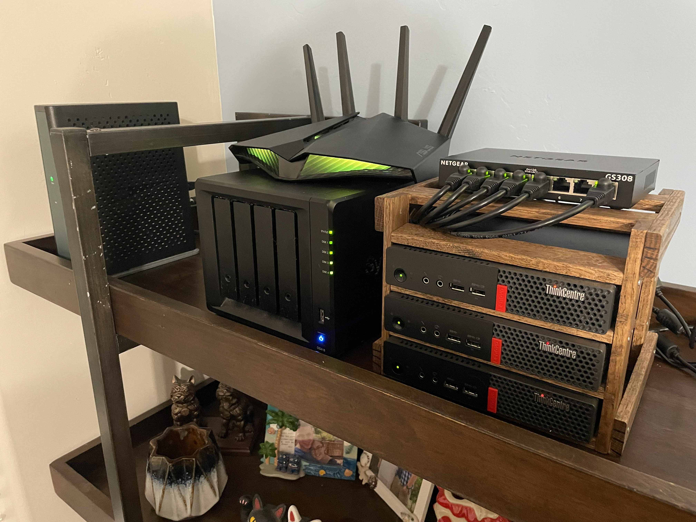
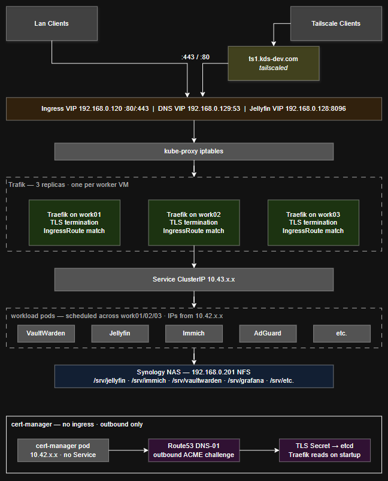

# homelab

### Virtualized locally hosted HA k3s cluster with NFS-backed storage

**Status: Infrastructure Complete — Application Migration In Progress**

---

## Deployment & Operations

For a full ordered rebuild guide covering NAS, WSL, Proxmox, Terraform, Ansible, k3s, and platform stack deployment see [docs/how-to-deploy.md](docs/how-to-deploy.md).

---

## Infrastructure and Network

Three ThinkCentre M710q Tiny nodes running Proxmox VE 9.1 form the compute layer. A Synology DS418 provides NFS-backed shared storage for VM disks and application data. All seven VMs are provisioned via Terraform using the bpg/proxmox provider and configured via Ansible.

[Hardware Specs](#hardware) | [Network Tables](#networks)

---

## Control Plane and Platform

Three control plane VMs run k3s with embedded etcd and kube-vip providing a floating API VIP at `192.168.50.110`. Three worker VMs handle all workloads. All management tooling (kubectl, helm, Terraform, Ansible) runs in the developer's WSL environment. A dedicated Tailscale VM (`ts1`) provides persistent remote access to the LAN and survives cluster failure, preserving the recovery path.

The platform layer runs on top of k3s:

| Component | Role |
|-----------|------|
| MetalLB | Bare-metal load balancer, L2 mode, pool `.120–.129` |
| Traefik | Ingress controller + reverse proxy, `192.168.50.120` |
| cert-manager | Wildcard TLS via Let's Encrypt DNS-01 + Route53 |
| NFS provisioner | Dynamic PV provisioning backed by Synology NAS |

---

## Services

Traefik reverse proxies all HTTPS traffic through `192.168.50.120`. AdGuard Home handles LAN DNS at `192.168.50.129` with custom rewrites pointing all `*.kds-dev.com` hostnames at the Traefik VIP. All application data is stored on the NAS via NFS mounts.

> *Diagram pending update to reflect current deployed state*

### Deployed

| Service        | Subdomain               | Purpose               |
|----------------|-------------------------|-----------------------|
| AdGuard Home   | adguard.kds-dev.com     | DNS + ad blocking     |
| Vaultwarden    | vaultwarden.kds-dev.com | Password manager      |
| Jellyfin       | jellyfin.kds-dev.com    | Media server          |
| Immich         | immich.kds-dev.com      | Photo management      |
| Synology Drive | share.kds-dev.com       | Family file storage   |
| Synology DSM   | nas.kds-dev.com         | NAS management portal |
| Homepage       | home.kds-dev.com        | Self-hosted dashboard |

### Pending Migration from Standalone Host

| Service              | Purpose                                   |
|----------------------|-------------------------------------------|
| Mealie               | Recipe and meal planning                  |
| Grafana / Prometheus | Monitoring — full redeploy, not migration |

---

## Storage

Proxmox is installed on each node's local SSD. All VM disks are stored on the Synology NAS via NFS (`vm-disks` export) so any node can run any VM. Application data lives under the `srv` NFS export with a subdirectory per application. The NAS itself runs RAID 5 across four 4TB disks with active/standby bonded NICs.

---

## Design Decisions

**Dedicated Tailscale VM (ts1)**
Runs the Tailscale daemon and advertises `192.168.50.0/24` to the tailnet as a VM under Proxmox HA rather than a Kubernetes pod. If k3s is broken, ts1 is the recovery path — it cannot depend on the thing it recovers.

**k3s on Proxmox VMs rather than bare metal**
Running k3s inside VMs provides clean role separation without additional hardware, VM-level snapshots before risky changes, and consistent OS images via cloud-init templating. Three control plane VMs maintain etcd quorum independently of the three worker VMs.

**Control plane and worker VMs pinned to their respective hosts**
One control plane and one worker are always present on each physical node. Without pinning the Proxmox scheduler could place two control plane VMs on the same node — losing that node would drop two etcd members simultaneously and break quorum.

**IP block segmentation as a VLAN substitute**
Without VLAN support on the current router, IP ranges within the /24 are segmented by role. Each block reserves the .x0 address for virtual IPs or floating addresses, with .x1–.x3 corresponding to which physical node a workload runs on. This makes the network self-documenting and provides a clear path to VLAN segmentation if router hardware is upgraded.

**k3s internal networks isolated from LAN**
The pod network (10.42.0.0/16) is a flannel VXLAN overlay tunneled between worker VMs — pods get ephemeral IPs the LAN never sees. The service network (10.43.0.0/16) exists only as iptables rules maintained by kube-proxy and is never transmitted on the wire. All external access is funneled through MetalLB service IPs in the `.120–.129` range.

---

## Known Limitations

1. **Flat /24 network** — current router does not support VLANs, so control plane, storage, and workload traffic share the same L2 segment
2. **NAS is a single point of failure for storage** — mitigated by bonded NICs and RAID 5, but a NAS failure takes down both VM disks and application data
3. **Tailscale free tier** — ts1 holds one of three device slots; Proxmox HA ensures it restarts on a surviving node if its host fails

---

## Networks

### IP Ranges — 192.168.50.0/24

| Range | Role |
|-------|------|
| .1 | Default gateway |
| .2–.99 | DHCP clients |
| .100–.109 | Physical nodes (.101, .102, .103) |
| .110–.119 | Control plane VMs (.110 VIP, .111–.113 VMs) |
| .120–.129 | MetalLB pool (.120 Traefik, .121–.123 worker VMs, .128 Jellyfin direct, .129 AdGuard DNS) |
| .130–.139 | Infrastructure VMs (.131 ts1 — Tailscale subnet router) |
| .200–.209 | Storage (.201 Synology NAS) |

### k3s Internal Networks

| Network | Range | Purpose |
|---------|-------|---------|
| Pod CIDR | 10.42.0.0/16 | Flannel VXLAN overlay — ephemeral pod IPs, not routable on LAN |
| Service CIDR | 10.43.0.0/16 | kube-proxy iptables rules — virtual only, never on wire |
| MetalLB pool | .120–.129 | Only cluster IPs visible on LAN — single entry point |

---

## Hardware

| Type | Role | Model | Notes |
|------|------|-------|-------|
| Compute | k3s node | ThinkCentre M710q Tiny | Intel i5 / 16GB DDR4 |
| Compute | k3s node | ThinkCentre M710q Tiny | Intel i5 / 16GB DDR4 |
| Compute | k3s node | ThinkCentre M710q Tiny | Intel i5 / 16GB DDR4 |
| Storage | NAS | Synology DS418 | 4x 4TB, RAID 5 |
| Network | Switch | Netgear GS308 | 8-port unmanaged |
| Network | Router | ASUS RT-AX82U | Home router |
| Network | Modem | ISP provided | — |