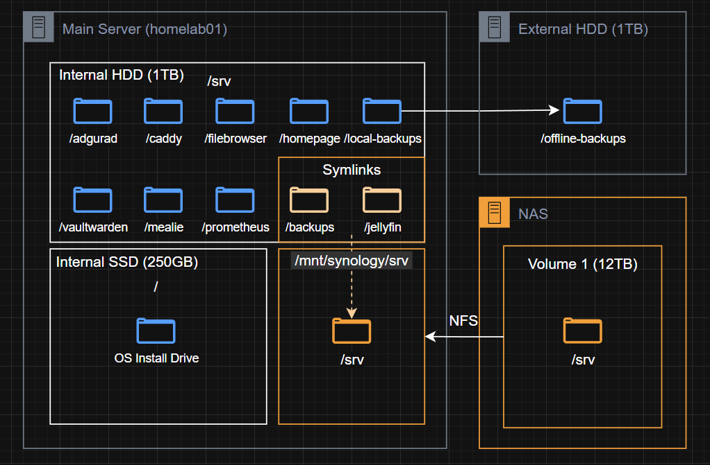
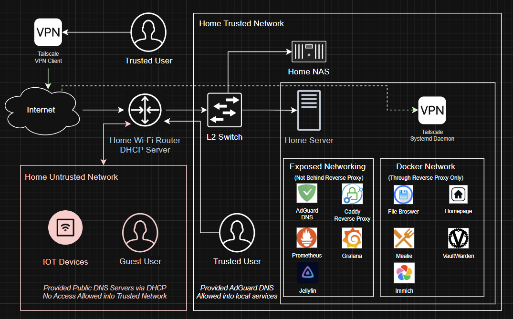
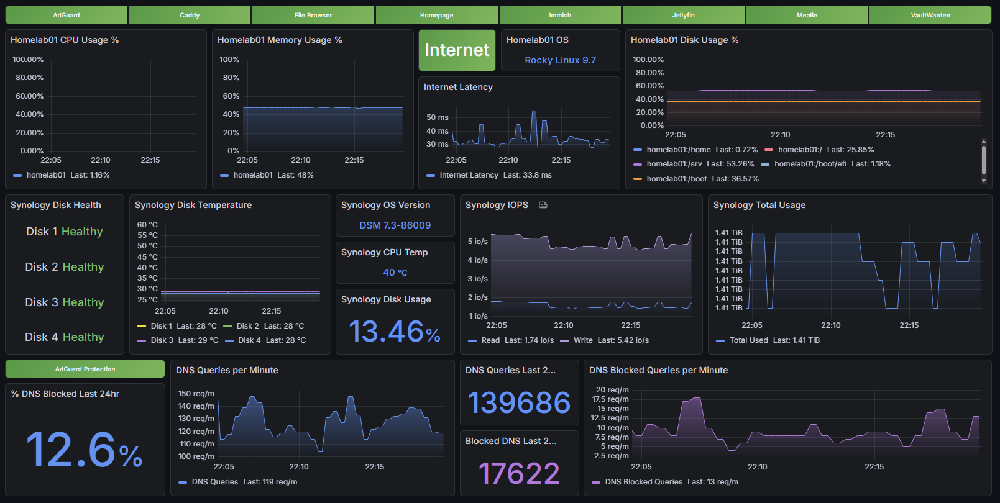
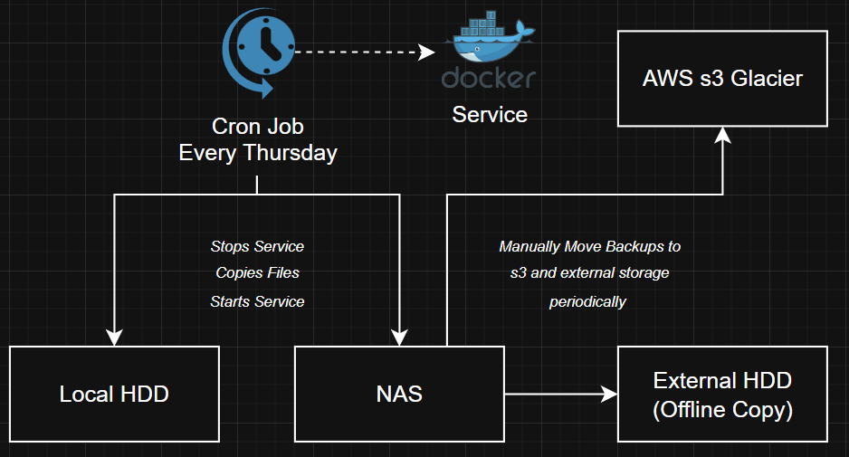

# Home Lab Infrastructure

A self-hosted environment built for my family — giving us control over our media, photos, passwords, and documents without depending on third-party cloud services. Built around reliability, security, and observability practices I use professionally as an SRE.

**Status:** Production — running daily for my household.

---

## Tech Stack

<p>
  
  
  
  
  
  
  
  
  
</p>

---

## Table of Contents

- [Why I Built This](#why-i-built-this)
- [Storage & Mounts](#storage--mounts)
- [Network & Access](#network--access)
- [Services](#services)
- [Monitoring & Observability](#monitoring--observability)
- [Backup & Disaster Recovery](#backup--disaster-recovery)
- [Deployment](#deployment)
- [Design Decisions](#design-decisions)

---

## Why I Built This

I wanted control over what my kids are exposed to online, a way to stream our own media library, and to stop depending on cloud vendors for things like photos, passwords, and documents. Everything here solves a real problem my household actually has.

- **Content control** — DNS-level filtering via AdGuard Home blocks ads and inappropriate content across every device on the network without touching individual devices
- **Media streaming** — Jellyfin replaced third-party streaming services with our own library, accessible to the kids on the local network
- **Photo management** — Immich replaced cloud photo backup; our family photos stay on hardware we own
- **Vendor independence** — passwords, files, and recipes all live on infrastructure I control and can restore from scratch

---

## Storage & Mounts


> *Disks, volumes, NFS mounts, and where data lives*

| Component | Role |
|-----------|------|
| Laptop (HDD) | OS and system drive |
| Laptop (SSD — `/srv`) | Active service data and local backup target |
| Synology NAS (NFS mount) | Jellyfin media library and backup destination |
| External SSD (offline) | Air-gapped backup copy, stored in a fireproof/waterproof safe |
| AWS S3 | Offsite backup — periodic uploads |

All Docker service data lives on the SSD under `/srv`. The NAS is NFS-mounted and serves two purposes — Jellyfin's media library and a backup destination. Nothing critical lives only in one place.

---

## Network & Access


> *Traffic flow, network zones, Docker networking, and access control*

All services run under `*.kds-dev.com` with publicly trusted TLS certificates issued via Let's Encrypt using a DNS-01 challenge against Route 53. TLS termination happens at Caddy.

Despite having valid public certs and real domain names, **nothing is exposed to the internet**. All external access goes through Tailscale — the domain resolves to internal IPs only reachable over the VPN mesh.

**Network zones:**
- **Docker Network** — services only reachable through Caddy
- **Exposed Network** — containers with no internet exposure, communicating only with clients on the trusted LAN

**Access model:**
- Local network — full access to all services, with AdGuard Home as DNS
- Tailscale — my wife's and my phones plus the server, for remote access
- Internet — nothing reachable; Caddy only listens on interfaces accessible via Tailscale or LAN

---

## Services


| Service | Purpose |
|---------|---------|
| **Jellyfin** | Media server — local network only, streams to TVs and devices in the house |
| **Immich** | Photo and video backup — replaces cloud photo storage for the whole family |
| **Mealie** | Recipe management and meal planning |


| Service | Purpose |
|---------|---------|
| **Vaultwarden** | Self-hosted Bitwarden-compatible password manager |
| **AdGuard Home** | Network-wide DNS filtering — blocks ads and content across all devices, enforces DNS over HTTPS for privacy |
| **Tailscale** | Mesh VPN for secure remote access |


| Service | Purpose |
|---------|---------|
| **Caddy** | Reverse proxy — TLS termination, automatic HTTPS, request routing |
| **FileBrowser** | Web-based file access for documents and shared files |
| **Homepage** | Internal dashboard — single pane of glass for all services |


| Service | Purpose |
|---------|---------|
| **Prometheus** | Metrics collection and storage |
| **Grafana** | Dashboards — all built from scratch |
| **Node Exporter** | Host-level metrics (CPU, memory, disk, network) |
| **Blackbox Exporter** | Internet connectivity, latency, and up/down monitoring |
| **SNMP Exporter** | Synology NAS metrics via SNMP |
| **AdGuard Exporter** | DNS filtering stats and query metrics |

---

## Monitoring & Observability



All dashboards are built from scratch in Grafana — no community imports. Four exporters feed Prometheus:

- **Node Exporter** — host CPU, memory, disk usage, and network throughput on the laptop
- **Blackbox Exporter** — probes internet endpoints for latency and availability; feeds the "is the internet actually working" panel
- **SNMP Exporter** — scrapes the Synology NAS over SNMP for disk health, volume usage, and network stats
- **AdGuard Exporter** — pulls DNS query stats, block rates, and client activity from AdGuard Home

The SNMP integration was worth the setup effort — it gives full visibility into the NAS without installing anything on it, which matters when the NAS is also a backup target and I don't want extra software risk there.

---

## Backup & Disaster Recovery


> *3-2-1-1-0 backup strategy across four storage locations*

### Strategy

| Copy | Location | Media |
|------|----------|-------|
| 1st | Laptop SSD (`/srv/backups`) | Internal SSD |
| 2nd | Synology NAS (NFS) | Network attached storage |
| 3rd | AWS S3 | Offsite cloud |
| 4th | External SSD | Air-gapped, offline |

The external SSD lives in a fireproof, waterproof safe bolted to the floor — the air-gap means ransomware or accidental deletion can't reach it.

### Schedule & Retention

- **Local + NAS backups** — Thursday nights, 4-week retention
- **Immich (photos)** — Thursday nights, 2-week retention (large dataset, more frequent churn)
- **AWS S3 + external SSD** — periodic; plugged in and synced manually when needed

### Backup Process

Each backup run follows the same pattern:
1. Pre-flight checks — disk space, permissions, NAS mount health
2. Graceful service shutdown via Docker Compose
3. Parallel compression with `pigz`
4. Service restart and health verification
5. Retention enforcement — old backups pruned to policy
6. Everything logged to syslog

Restore procedures are documented and tested for each service. A backup that has never been restored is not a backup.

---

## Deployment

The entire server — OS config, Docker, TLS, all services, backup cron jobs, and monitoring — is provisioned via Ansible from the `ansible/` directory.

```bash
# 1. Install collections
ansible-galaxy collection install -r ansible/requirements.yml

# 2. Place secret .env files in ansible/env/ (see ansible/env/README.md)

# 3. Full provisioning run
ansible-playbook -i ansible/inventory.yml ansible/site.yml \
  -e "aws_access_key_id=AKIA... aws_secret_access_key=..."
```

Roles run in order and are fully idempotent: `base` → `storage` → `docker` → `tls` → `services` → `backup` → `monitoring`.
Run individual roles with `--tags <role>` (e.g. `--tags services` to redeploy compose stacks).

All variables — service list, backup schedule, paths, domain — live in [`ansible/group_vars/all.yml`](ansible/group_vars/all.yml).

---

## Design Decisions

**🔒 Publicly trusted certs with zero public exposure**
Using Let's Encrypt with a DNS-01 challenge means I get real, browser-trusted certificates for all services without opening any ports to the internet. Caddy handles renewal automatically via Route 53. Everything resolves correctly on LAN and over Tailscale — it just doesn't resolve anywhere else.

**📡 SNMP for NAS monitoring instead of installing agents**
The Synology NAS is a backup target — I want as little extra software running on it as possible. SNMP is built into DSM and exposes everything I need. Running the SNMP exporter as a Docker container on the laptop keeps the monitoring stack self-contained.

**🔄 Node Exporter + Blackbox over a custom exporter**
An earlier version of this lab ran a custom Python exporter. Replacing it with Node Exporter and Blackbox Exporter gave better coverage, more reliable metrics, and less code to maintain. Using the right tool matters more than building your own.

**🏠 Jellyfin local-only by design**
Jellyfin is not exposed externally — not through Caddy, not through Tailscale. It's a household service for the local network. Keeping it off the access path entirely reduces attack surface and simplifies the network model.

**💾 NFS mount for media and backups**
Jellyfin's library and one backup destination live on the NAS via NFS rather than copying data to the laptop. Keeps the SSD free for active service data and means the media library can grow independently of local storage.

---

## License

MIT