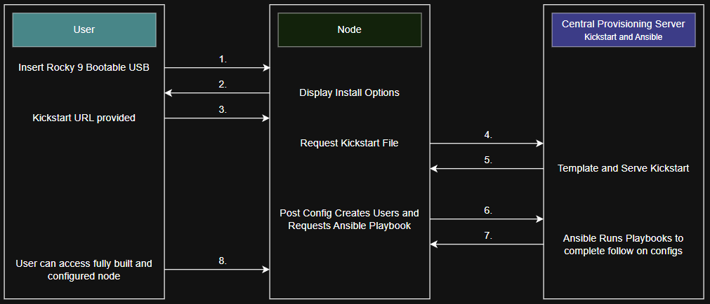
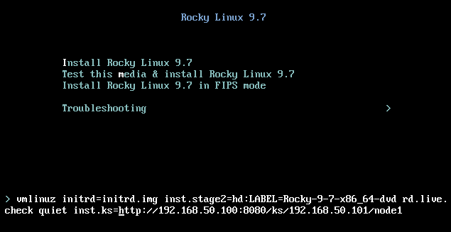

# Provisioning

Zero-touch bare metal provisioning. Boot a node from the Rocky Linux 9 ISO, append a single boot parameter, and walk away. The node installs itself, calls back to the provisioning server, and Ansible converges it automatically — all before the reboot completes.

---

## How it works



1. A central provisioning server hosts the kickstart template and runs the Ansible playbooks
2. When booting a new node, the kickstart URL is passed as a boot parameter — the provisioning server responds with a rendered kickstart file containing the correct IP, hostname, and password hash
3. The kickstart file handles OS installation only — packages, disk layout, user creation, and SSH configuration
4. On install completion, the node sends a callback to the provisioning server
5. The provisioning server spawns an Ansible run against that node. By the time the node finishes rebooting, Ansible has already converged it
6. All future configuration changes are applied exclusively via Ansible, ensuring every node stays identical and can be rebuilt at any time

---

## Quick Start — Provisioning Server

### Prerequisites

- Fresh Rocky Linux 9 install on a VM or bare metal machine with a static IP on your LAN
- Bridged networking so provisioned nodes can reach the server during install
- An SSH key pair at `~/.ssh/ansible` — this public key gets deployed to every provisioned node

Generate one if you don't have one:
```bash
ssh-keygen -t ed25519 -C "homelab-ansible" -f ~/.ssh/ansible -N ""
```

### Bootstrap

Download and run the bootstrap script:
```bash
curl -O https://raw.githubusercontent.com/KDScheuer/Home-Lab/v2/provisioning/bootstrap.sh
chmod +x bootstrap.sh
./bootstrap.sh
```

The bootstrap script will:
- Update system packages and install git, python3, ansible, and tmux
- Clone the v2 branch of this repository
- Auto-detect the provisioning server's IP and inject it into the kickstart template
- Inject the `~/.ssh/ansible` public key into the kickstart template — provisioned nodes receive this key at install time and disable password auth entirely
- Open port 8080 in firewalld
- Start the kickstart HTTP server in a background tmux session

### Verify the server is running

```bash
tmux attach -t kickstart_server
```

The server is ready when you see it listening on port 8080. Detach with `Ctrl+B, D`.

---

## Quick Start — Node Deployment

1. Boot the Rocky Linux 9 ISO. At the first installer screen, press `Tab` to edit the boot parameters and append:

    ```
    inst.ks=http://<provisioning-server-ip>:8080/ks/<node-ip>/<hostname>
    ```

    Example:
    ```
    inst.ks=http://192.168.50.4:8080/ks/192.168.50.101/k3s-node1
    ```

    

2. Press `Enter`. The installer fetches the kickstart file and runs unattended. On completion the node calls back to the provisioning server, Ansible runs automatically, and the node reboots into a fully configured state.

---

## Files

| File | Purpose |
|---|---|
| `bootstrap.sh` | Idempotent setup script for the provisioning server |
| `http-server.py` | Dynamic kickstart HTTP server — serves rendered kickstart files and triggers Ansible on node callback |
| `homenode.ks` | Kickstart template — per-node values (`{{ ip }}`, `{{ hostname }}`) are substituted at request time by the HTTP server; server-scoped values (`{{ server_ip }}`, `{{ ansible_pub_key }}`, `{{ ansible_password_hash }}`) are rendered once by `bootstrap.sh` |

> **Note:** The kickstart template uses `%pre` to dynamically discover the active network interface at install time. It selects the first active non-loopback interface whose name begins with `e`, covering both `ens` and `eth` naming schemes without any hardcoded interface names.

